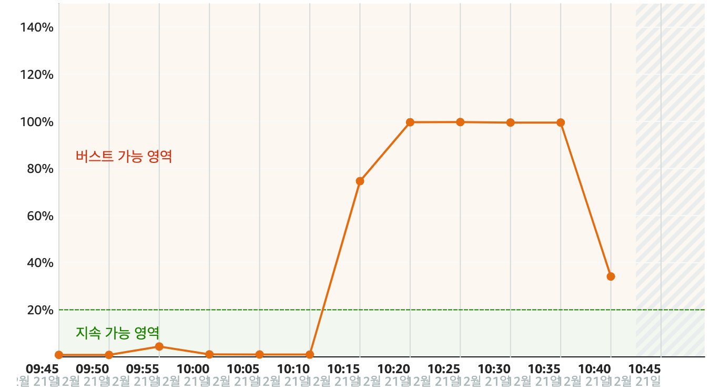
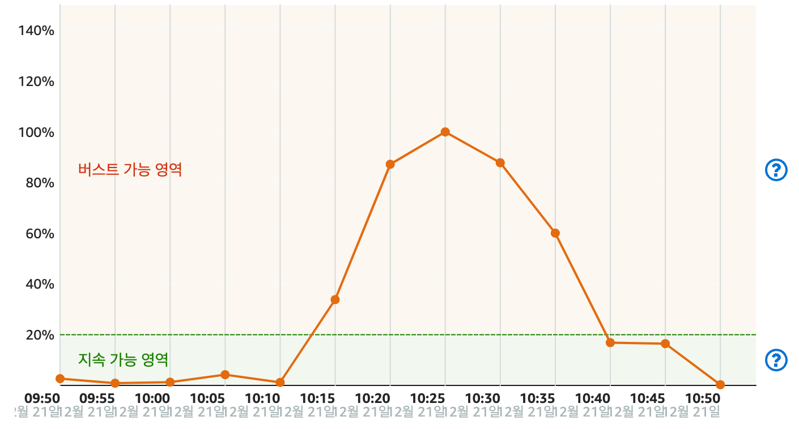

# 💡 VSCode Remote server CPU 사용량 100% 이슈

## 📌 문제 상황

AWS Lightsail Instance 들(상용 서버, 개발 서버)에 대해 작업 진행중에 SSH로 원격 접속한 것들이 모두 갑작스레 끊기는 현상을 겪었다.

AWS Lightsail Instance의 지표 항목에선 CPU 사용량등 시스템 자원의 사용량 및 네트워크의 트래픽 등을 확인할 수 있는데, 가장 먼저 발견할 수 있던 것은 다음의 사진과 같이 CPU의 사용량이 급증한 것이였다.

CPU 사용량이 계속해서 높다보니, 원격 접속들도 모두 끊기는 것 외에 상용 서비스들로의 접속도 되지 않는 상황이 발생했다.

(이슈를 해결하고 나서 캡처한 것이기에, 해결 후 CPU 사용량 변화까지 확인 가능하다.그 순간에는 얼른 해결해야겠다는 생각밖에 들지 않았다.)

## 📌 문제 해결 단서

문제 상황을 인지했지만, 원격 접속이 되지 않기 때문에 당장 해결할 수 있는 방법은 우선 Instance의 재실행 이였다.

재실행 직후에 시스템 자원 사용량을 모니터링하기 위해 [`htop`](https://htop.dev/)을 사용했다.

htop을 통해 살펴보자 vscode-server process의 CPU 사용량이 99%를 계속해서 유지하고 있었다.(아쉽게도 캡처하지는 못했다)

이를 확인하고 다시금 원격 접속이 끊겼다.

## 📌 해결 과정

일단 원격 접속이 계속해서 끊기고 있었기 때문에 해결 방법을 찾고 Instance를 중단(종료) 시킨 뒤 빠르게 재 실행 및 해결해야한다 판단했다.

`vscode-server의 CPU 사용량 100% 이슈`라는 주제로 자료를 조사했고 다음의 영상에서 소개하는 방법으로 해결 할 수 있었다.

[https://www.youtube.com/watch?v=36Hm1DEl82M](https://www.youtube.com/watch?v=36Hm1DEl82M)

1. vscode의 설정에서 `search.followsymlinks`를 검색한다.
2. 체크를 해제한다.
3. `shift + cmd + p`를 눌러 명령창을 킨다.
4. Remote-SSH: Kill Current VS Code Server를 눌러 실행시킨다.

vscode의 검색이 [심볼릭 링크](https://ko.wikipedia.org/wiki/%EC%8B%AC%EB%B3%BC%EB%A6%AD_%EB%A7%81%ED%81%AC)까지 포함하도록 하는 설정이다.

이를 해제하여 파일 변화를 감지하는 vscode의 작업량을 줄여주는 것으로 해결할 수 있는 것이다.

우선 개발 서버를 중단 및 재실행 시켰다. 설정 해제 후 원격 서버의 vscode-server를 종료 시켜주고 다시 접속 했다. 이후에는 첫 접속시에만 CPU 사용량이 잠깐 올라갈 뿐 나머지는 평소의 사용량에서 크게 벗어나지 않았다.

개발 서버가 제대로 돌아가는 것을 확인하고 바로 상용 서버에도 똑같이 적용 및 프로세스들에 대해 재실행을 진행하자 서비스들에 대한 접근도 원활히 이루어졌다.

확인하자 마자 온몸에 힘이 쫙 빠지는 경험을 했다.

## 📌 깨달은 점

### 👉 한번 더 확인하고 상용 서버에 적용하기

무슨 작업을 하더라도 개발 서버에서 확인을 하고 상용 서버에 반영 해야 됨을 머리로만 아는 것이 아니라 몸으로 체감 했다.

개발 서버에서 문제 없다고 속단하고, 상용 서버에 바로 사용한 것이 이번 문제의 뿌리였다.

머리로는 알고 있는 사실인데, 직접 경험하고 나니 경각심이 올라갔다.

앞으로는 급하다는 이유로 경솔하게 행동하지 않아야 함을 배웠다.

### 👉 팀원의 소중함

이전 직장들까지는 홀로서기가 아니였기 때문에, 이슈가 터지더라도 함께 극복할 수 있어 이정도로 긴장감을 가진적은 없었던 것 같다.

그러나 현 직장에선 1인 개발자이며, 상용 서비스도 있기 때문에 일이 발생하면 온전히 혼자 감당을 해야한다는 점에서 팀원의 존재에 대한 소중함을 깨달았던 것 같다.

## 📌 마무리

이슈 해결 직후 대표님께 상황에 대해 처음부터 해결까지 전달드리니 책임을 묻고 질책하시기 보다 고생했다는 말씀 해주셔서 감사함을 느끼고 더 잘해야겠다는 생각이 들었다.

모든 개발이 나로부터 이루어지니, 회사에서 발생할 수 있는 이슈는 나로부터 발생할 수 있다는 책임감을 느꼈다.

처음 입사할 때 당연히 이런 상황을 고려했지만, 실제로 겪어보니 그 긴장감이 이루 말할 수 없었다. 

그럼에도 이런 경험을 통해 내 앞에 있는 벽을 또 하나 넘었다는 사실을 알 수 있었기에 나는 지금 행복함을 느낀다.
