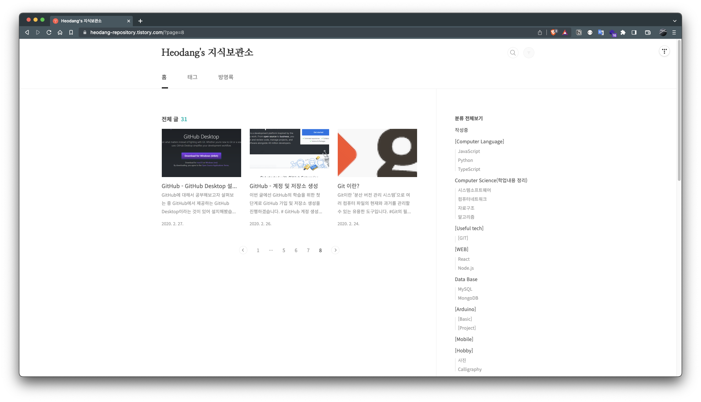

# #블로그 (다시) 시작하기

관심은 있었지만, 제대로 운영해본적 없는 블로그 운영을 다시 시작해보려 합니다.

이번 글은 새로운 시작에 대한 이야기 전에 이전 블로그 운영에 대한 회고를 잠시 해보고, 앞으로의 블로그 운영에 대한 다짐이자 제 인생에 대한 다짐 정도를 적어보겠습니다.

## 목차

[이전 블로그 회고](#이전-블로그-회고-3년이나-지나-추측성이지만)

- [블로그 운영, 왜?](#블로그-운영-왜)
  - [취업에 대한 두려움](#취업에-대한-두려움)
  - [칭찬이 필요해](#칭찬이-필요해)
  - [광고비로 용돈 벌어보고 싶어](#광고비로-용돈-벌어보고-싶어)
- [왜 그만둬?](#왜-그만둬)
  - [검색하면 다 나오는데 내가 정리하는게 의미가 있을까?](#검색하면-다-나오는데-내가-정리하는게-의미가-있을까)
  - [포스팅 정리할 시간에 코드 한줄 더 치는게 낫지 않을까?](#포스팅-정리할-시간에-코드-한줄-더-치는게-낫지-않을까)

[새로운 블로그 운영에 대한 다짐!](#새로운-블로그-운영에-대한-다짐)

- [왜 다시 시작해?](#왜-다시-시작해)
  - [생산성에 대한 얘기를 들었어](#생산성에-대한-얘기를-들었어)
  - [새로운 시도가 필요해]
- [어떻게 운영할 거야?]

  - [마크다운만 지원한다면]
  - [당분간 생산성을 저해하는건 포기야]

- [마무리]

 

## #이전 블로그 회고 ~~(3년이나 지나 추측성이지만)~~

> 💡 나 스스로가 기준이 아닌채로는 지속할 수 없다.

이전에 운영했던 블로그는 [허당의 지식보관소](https://heodang-repository.tistory.com/) 였습니다.

3년전 4개월이라는 시간 동안 31개의 글을 작성했습니다. 개발자가 되고 싶었기에 개발 공부 한것들을 위주로 포스팅 했습니다.

당시 블로그를 운영하게 된 계기에 대해 말씀드리겠습니다.

### #블로그 운영, 왜?

#### #취업에 대한 두려움

먼저 취업 때 쓸 포트폴리오를 만들기 위해서 블로그를 시작했습니다.

당시에 저는 프로젝트 경험이라곤 하나도 없이 학교에서 공부만하고, 생활코딩 이고잉 님의 WEB 강의를 들으며 뭘 해야할지 모르는 학생이였습니다.

3학년까지 마친 상태의 저는 **"앞으로 취업은 해야되고 이렇다할 경험은 아무것도 없네... 어쩌지...?"** 라는 암울한 생각에 깊이 빠져있었고, **"이대로는 안되겠다 클론코딩 강의라도 보고 따라하면서 프로젝트가 뭔지 좀 알아야겠다."** 하며 휴학을 결정합니다. (코로나 초기라 학교가기 조심스러웠던 것도 한 몫 했습니다.😅)

휴학 생각도 있고, 취업 준비를 제대로 해보기로 다짐했기 때문에 git 사용 부터 차근 차근 정리해야겠다는 생각으로 시작했습니다.

#### #칭찬이 필요해

두번째로 공부한 것에 대한 칭찬이 필요했던 것 같습니다.

저는 초등학생 때부터 대학 때까지 동급생들로 부터 **"설명을 진짜 잘해!"** 라는 칭찬을 들었습니다.

그래서 앞으로 가고 싶은 개발자의 길에서도 **설명을 잘한다는 칭찬을 지속적으로 받고 싶어** 블로그를 통해 "나 이만큼 공부했고, 잘 설명하고 있어!" 하고 티를 내고 싶었던 것 같습니다.

#### #광고비로 용돈 벌어보고 싶어

### #왜 그만둬?

#### #검색하면 다 나오는데 내가 정리하는게 의미가 있을까?

#### #포스팅 정리할 시간에 코드 한줄 더 치는게 낫지 않을까?

## 새로운 블로그 운영에 대한 다짐!

> 💡 나 스스로의 만족에 의해 움직이자. 내 인생은 내가 주체다.

### #왜 다시 시작해?

#### #생산성에 대한 얘기를 들었어
