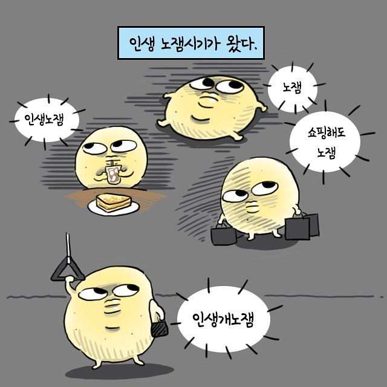

# 💡 퇴사-후-4개월-회고

> 글을 쓰다 보니 너무 길어지네요..ㅎㅎ
> 목차만 보셔도 어느정도 주제는 전달될 것이라 생각합니다 :)

휴식기에 대한 회고 글이기에 아래부터 구어체로 진행하겠습니다.

2023년 8월 달 부터 약 4개월 간 휴식기를 가졌다.

2년을 채우지 못한 직장 생활 동안 2곳의 회사에서 일 했다
두 곳에서 모두 열심히 했고 반갑지 않은 "번아웃", 흔히들 말하는 "인생 노잼시기"가 일찍 찾아왔다.

출처: 인스타그램 g_zaing
상세: <https://www.instagram.com/p/BpXEVT_FB_e/?utm_source=ig_web_copy_link&igshid=MzRlODBiNWFlZA==>

지금은 휴식기를 통해 몸과 마음을 재정비 하는 시간을 지내서인지 어느정도 극복했다. 또한 "갓생"을 살아내기 위해 노력하는 중이다.

아래에선 일련의 과정에 대해 좀 더 자세하게 얘기를 해보려한다.

## 📌 왜 퇴사 했어?

### 👉 원했던 포지션과는 다른 일

첫 회사에선 목표로 하던 **Node.js 서버 개발자로 취업**을 했지만 내부의 상황 상 갑작스레 **Flutter 앱 개발**을 맡게 됐다.

당시 나는 다음과 같은 생각으로 불만은 있지만 일을 해냈다.

- 스타트업의 특성 상 일손이 부족하겠지.
- 잠깐하면 원래 앱 개발 하던 파트로 인수인계 하고 서버 업무 맡겨 주겠지.
- 필요한 걸 만들어 내는게 개발자고, 회사에서 원하니까 해내자.
- 첫 회사인데 좋은 경험한다 생각하고 열심히하자.

위와 같은 생각으로 Flutter를 공부하며 프로덕트를 만들어 냈다.
**다행히 Flutter를 배우고 다루는 것은 흥미가 있었다**.

하지만 그래서 인지 **잠깐이면 될 줄 알았던 업무가 1년이라는 기간동안 이어졌다**.

### 👉 성장을 가로막은 능숙하지 못한 대화 스킬과 관리되지 않은 시간

1년 동안 일하며 발전하지 못한 것은 내 생각을 펼쳐보이지 못한 것 때문이다.

회사의 CTO 님과 거의 붙어서 일했는데, 아무래도 경험이 많으시다 보니 업무를 할당하고 방향을 결정할 때 내 생각을 빼고 그대로 따르기 바빴던 것 같다.

지시사항에 따라 개발하다보면 자연히 비효율적인 부분들이 발견되고
이를 위한 자료들을 많이 마주했음에도 불구하고,
의견을 제시할 때 **대화의 기술이 부족**해서 였는지 혹은 **내 의견을 밀어 붙일 용기가 부족**해서 였는지 토의를 해보지 못하고 내 의견을 굽히는 것을 택하며 문제를 해결하지 못했다.

그러다 보니 비효율적인 요소가 점점 쌓여 나중엔 개인 시간을 거의 갖지 못하게되고,
시간이 나더라도 잠을 자거나 노는 등 시간을 효율적으로 쓰지 못했다.

이때 좋은 구조와 좋은 코드를 작성하는 것에 대해 집착하는 것이 커진 것 같다.

그렇게 성장을 위해 공부하거나 프로젝트를 진행하지 않은채 1년 조금 넘는 시간을 보내,
첫 직장에서 퇴사를 진행했다.

### 👉 책임을 회피하기만 하는 나, 다시 스트레스 받는 나

첫 직장 퇴사 후 마침 회사의 동료분이 이직한 곳에서 스카웃 제의가 와서 이직을 진행하게 됐다.

두번째 직장은 풀스택 개발자로 취업을 진행했다.

해당 회사는 프로덕트를 만들어내는데 기간이 짧게 주어졌다. 그에 따라 기획하는 기간 또한 짧았다.

빠른 시간내에 프로젝트의 방향을 파악하고, 기능들을 구현해 나갔다.
개발하며 오류가 나는 부분은 당연히 발생할 수 있는 영역이고,
최대한 오류로 부터 안정적으로 운영될 수 있도록
설계를 해놓는 부분이 중요하다 생각한다.
그렇기에 동료분들과 노력했다.

하지만 경영진들이 개발 영역을 너무 쉽게만 보는 상황 속에서 돌아오는 평가들은 곱지 못했다.
기획이 부족한 부분에서 나는 오류 조차도
"개발 팀에서 잘못만들어서 그렇다",
"이런 간단한 부분 수정하는데 왜 그리 오래 걸리냐",
"이런 부분은 개발자라면 기본 소양아니냐" 와 같은 상황을 조우 했었다.

이런 상황이 반복되니 점점 책임을 회피하게 됐고,
회피를 반복하니 서비스에 대한 열정이 식어가며
개발 속도도 안나고 오류가 나는 상황이 반복되어
다시 스트레스를 받는 상황이 생겼다.

### 👉 열정적이고 체계적인 환경이 필요해

첫 번째와 두 번째 회사를 다니는 동안 계속 든 생각이 있다.

"좀 더 체계화 된 회사에서 일하고 싶다"라는 생각이다.

회의 때 논의 됐던 내용을 토대로 작업을 진행하고 공유하면 왜 이렇게 했느냐는 말이 돌아왔다.
또한 위에서 말한 것 처럼 기획이 부족한 부분에서 그 때마다 물어가며 작업한 내용에서 오류가 나니 결국 개발자들의 잘못으로 돌아오는 상황이였다.

이런 환경에서는 도저히 못 버티겠다라는 생각이 들며 퇴사를 결정했다.

## 📌 4개월을 어떻게 보냈어?

### 👉  우울감의 끝에서 일기 쓰기, 운동, 독서를 시작한 8월

[나의 삶의 지도] 초반에 언급한 내용 처럼 퇴사 시점에 암울한 상황들이 겹치며
"내가 진짜 잘못 살았다"하는 자책과 죄책감으로 인해 8월의 약 3주간을 점점 깊숙하게 어두운 동굴 속으로 나를 밀어 넣었다.

8월의 마지막 주에, 동굴의 끝에 도달해서 일까? 이대로 있는다고 상황이 나아질 수는 없다는 생각을 잠깐 했었다.

그 잠깐의 생각과 우연치 않게 일기를 쓰는 것으로 하루를 잘 관리하게 됐다는 유튜브 영상을 보게되며 나도 일기를 써보기 시작했다.

일기 외에도 운동과 독서를 진행했다.

### 👉 많은 생각들이 폭발하며 롤러코스터를 타던 9월

8월 말부터 일기를 쓰기 시작하며 이런 저런 생각들을 해봤다.

초반에는 무조건 적으로 부정적인 생각만 가득했다. 하지만 하루 하루 시간이 지나면서 용기를 내어 나를 받아들이는 과정들을 거쳤다.

- 내가 왜 이런 상황에 처하게 됐을까?
- 내가 그 때 이런 말과, 이런 행동을 했다면 지금 상황은 나았을까?
- 내가 부족한 점이 있다는 것을 받아들이자. 부족한 점은 채우면 된다.
- 불현듯 슬픔에 잠긴다. 나 잘 살 수 있을까?
- 걱정은 대부분 내 머리속에서 일어나고 끝나는 일이다. 내가 어디에 있고 싶고, 어떤 역할을 하며, 어떤 시간을 보내고 싶은지에 집중하자.
- 지치고 힘들 때 포기를 계속 선택한 결과를 눈으로 봤으니, 이제는 더 이상 포기를 제일 먼저 택하지 않겠다.
- 나는 어떤 개발자가 되고 싶을까? 더 나아가 어떤 사람이 되고 싶은 걸까?

등등 하루 하루 기록한 일기를 보면 정말 생각이 많았던 9월달이였다.

### 👉  사람들을 만나며 생각을 정리해나간 10월 ~ 11월

가족들과 여행을 가고, 친구들도 자주 만나고, 여행도 다니며 퇴사 후에 제대로된 환기 기간을 보냈다.
또한 혼자서 진행하던 프로젝트에서 팀프로젝트로의 발전을 위해 개인 프로젝트 팀원을 모집해보고, 전 직장 동료분들이 진행 중인 프로젝트에 합류하는 등 오랜만에 사람을 많이 만나는 기간이였다.

각기 다른 방법으로 나를 응원해주고,
각기 다른 방법으로 열심히 즐겁게 살아가는 모습을 보면서 부정적인 생각들이 걷혔다.

나도 언젠가 저들이 힘든 순간을 마주하면 도움을 줄 수 있는 존재가 되고 싶다는 생각을 하게 됐다.

이 기간 동안 감사하게도 두 곳의 스타트업에서 합류할 의사가 있는지 커피 챗 제안을 주셨고 모두 만나 이야기를 나눠봤다.
두 번째로 연락을 주신 곳의 서비스 주제와 환경이 나에게 더 흥미롭게 느껴져 합류하게 되었다.

> 늘상 신기한 부분이다.
> 내가 문제를 겪고 있고, 이에 대해 마음을 비우기 시작하면
> 누군가 이를 보고 도움을 주려는 듯 내게 기회가 생긴다.

## 📌 그래서 지금은 어때?

### 👉 나의 속도로 느리지만 천천히 살며, 사람과 교류하겠다.

**"내 인생이라는 영화에 나는 주인공이 아니다. 나는 감독이다."**

어디서 봤던 말인지는 기억 날 때 적어두겠다.
이 말 덕분에 내 인생을 내가 주체적으로 결정하며 살아야한다는 것을 다짐하게 됐다.

여지껏 살면서 정말로 내 인생을 내가 중심이 되어서 살았던 것 같지 않다.
계속해서 주위에서 원하는 방향으로 살려고 했다. 그게 나를 위한 거라 생각하면서.
항상 그랬던 것은  아니만 싫은 소리를 잘 못했다.

이제는 내 의견을 가지고 내 인생의 주권을 지닌 나를 지키면서 살아보려고 노력하고 있다.

### 👉 내가 너무 거만했다. 주어진 상황에서 배울 수 있는 것들을 찾아 배우자.

쉬는 중에 [미국가서 중국어 공부하지 않기](https://jojoldu.tistory.com/733) 글을 읽었다. 글의 끝에 가면서, 머리가 띵했던 것 같다.

나는 체계화되지 않은 스타트업에서 체계화된 일을 하길 원했다.
그를 위해서 노력하지 않았고 바라기만 했던 것이다.

내가 원하면 먼저 움직이고, 밀어 붙일 줄도 알아야했지만 그런 것 없이 바라기만 하고 주어진 일만 했던 것이다.

정말 미국가서 중국어 공부를 하고싶어한 상황이며, 그것에서 스트레스를 받아 퇴사까지 했다.

향로님의 글을 읽고 나서야 비로소 정신을 차리게 됐다.

나는 현재 내가 보유한 기술스택이나 성향 상 스타트업이 맞다.
그러면 거기서 배울 수 있는 것 그리고 해낼 수 있는 일들을 하며 성장해나가자고 말이다.
더이상 행동하지 않고 바라기만하는 거만한 태도를 보이지 말자.

### 👉 나는 어려움을 해결하고, 도움을 주고 싶어하는 사람이다. 그래서 결국 좋은 개발자는 좋은 구조, 좋은 코드를 신경쓰는 개발자가 아니다. 몸 담은 곳에서 필요로하는 프로덕트를 원활하게 생산해내는 것이 좋은 개발자다.

"어떤 사람이 되고 싶었던 걸까"를 아니 처음엔 "어떤 개발자가 되고 싶은거지?"를 고민하기 시작했다.
개발하는 것을 싫어하진 않지만, 회사에서 만드는 서비스에 애정이 없어지며 퇴사를 결심하게 됐으니까 말이다.

분명 처음에는 좋은 개발자가 되고 싶었고, 그랬기에 좋은 코드 품질과 좋은 구조에 관심을 뒀었다.
하지만 결과적으로 이런 것들에 관심을 두고 계속해서 자료를 찾아보고 고민만 했을 뿐 프로덕트를 만들어내지 못했다.

"내가 생각하는 좋은 개발자가 진짜 좋은 개발자인가?", "좋은 개발자"는 잘 모르겠다.
그럼 "어떤 사람이 되고 싶은거지?"부터 생각하자하며 내 특징들 중 내가 좋아하고 만족감을 느끼는 부분들을 찾았다.

"타인 사람을 돕는 것에서 만족감을 느끼고, 도움으로 인해 문제가 해결되 상황이 좋다."

이런 특징이 "개발자로서 타인을 돕자", 그리고 "도울만한 실력을 쌓자"라는 것으로 귀결됐다.

타인을 돕는 것은 결국 문제해결을 위한 프로덕트를 만들어내는 것이다. 프로덕트를 만들며 좋은 구조와 좋은 코드는 당연히 실력을 쌓아 품어야될 기본 소양이였던 것이라고 생각한다.

## 📌 앞으로는 뭐 할 생각이야?

위에서 잠깐 언급했지만, 스타트업에 1인 개발자로 합류하게 됐다.
글을 작성하고 있는 현재(2023.12월 1주차) 합류한지 1주일이 지났고 2주차를 보내는 중이다.

이번주까지는 기존에 운영되오던 서비스를 개편하기 위한 기획을 했고, 서서히 개발에 들어갈 예정이다.

이번엔 미국가서 중국어 공부를 할 생각 따위 없고, 책임감을 갖고 서비스의 기획에도 참여하고 개발 계획도 세우고 있다. 부족한 부분이 많지만 이를 극복하기 위해 여러모로 개인적인 노력도 하고 있고, 감사하게도 주변에 도움을 받을 수 있는 분들이 많아 너무 불안해하지도 않고 있다.

내 인생에 커다란 변곡점을 지나가는 중이라는 느낌이 든다.
꺾일 때의 모습보다 완만하지만 높게 가보려한다.

앞으로의 포스팅엔 스타트업에서 프로덕트를 만들어나가며 겪는 문제들과 해결 과정을 전달할 계획이다.

지켜봐주면 좋을 것 같다.

이상 :)
